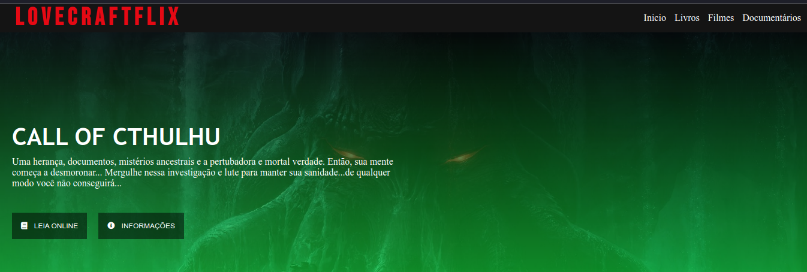

# Desafio
Recriando a interface do Netflix

"Recrie a interface do principal site de streaming mundial utilizando tecnologias simples como HTML5, CSS3 e JavaScript. Nesse projeto você aprenderá: como estruturar um layout, técnicas de CSS3 com containers e variáveis, como posicionar os elementos com Flexbox e como utilizar plugins Jquery a favor da sua aplicação."

## Observações

Seguindo a sugestão do instrutor desenvolvi a interface do LOVERCRAFTFLIX. Site voltado para divulgação das obras do autor H. P. Lovecraft e outras do mesmo genero e/ou generos correlatos, horror e horror cósmico.

## Tecnologias
* Htm5
* CSS3
* Flexbox
* Conceitos de Responsividade
* Reset CSS
* Classes Wrapper
* JQuery (Carrossel Owl)

## Fonte da Logo

Após algumas pesquisas pela net usei como fonte da logo a font-family, Bebas Neue ([Google Fonts](https://fonts.google.com/specimen/Bebas+Neue?query=beba))

## Instrutor(a)

Felipe Aguiar

## Entidade

Digital Inovation one 

Boot Camp HTML Web Developer

[DIO](https://digitalinnovation.one/sign-up?ref=8EJE9QGVQT)

## Autor
Edson souza
[Linkedin](https://www.linkedin.com/in/edsonfrs/)
[GitHub](https://github.com/Edsonfrs)

